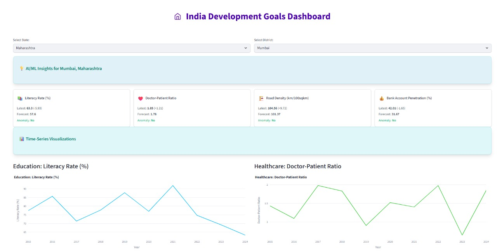
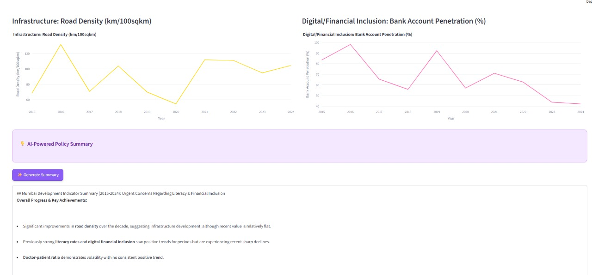
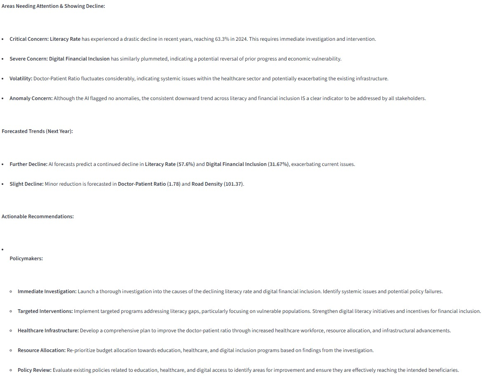
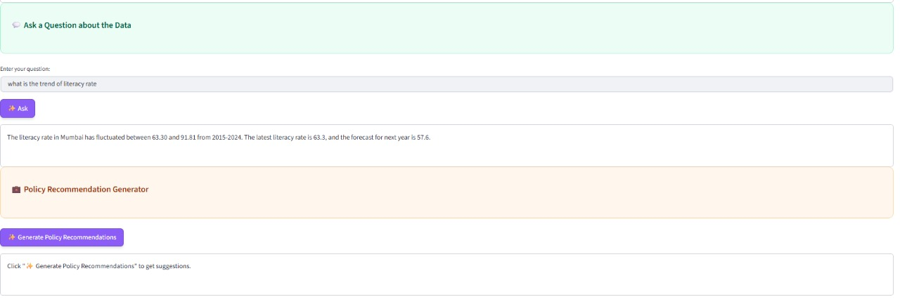

# 🇮🇳 India Development Goals Dashboard

[](https://share.streamlit.io/)
[](https://www.python.org/downloads/)
[](https://ai.google.dev/)
[](https://opensource.org/licenses/MIT)

An AI-powered analytics dashboard designed to monitor and visualize India's progress towards key development goals across education, healthcare, infrastructure, and digital/financial inclusion.



## 🌟 Key Features

- **Interactive Visualizations**: Exploratory data analysis with localized filtering by states and districts.
- **AI/ML Insights**: Automated anomaly detection, trend forecasting, and performance metrics.
- **Gemini AI Integration**:
    - **Policy Summaries**: Intelligent, actionable summaries for policymakers.
    - **Interactive Q&A**: Ask natural language questions about the development data.
    - **Recommendation Engine**: Sector-specific policy recommendations based on analyzed trends.
- **Time-Series Analysis**: Detailed historical trends for over 10 development indicators.

## 🖼️ Visual Showcase

| Main Dashboard & Insights | AI-Powered Policy Summary |
| :---: | :---: |
|  |  |
| *Overview of the filters and insights panel.* | *Detailed charts and automated summaries.* |

| Predictive Analysis & Recommendations | Interactive AI Q&A |
| :---: | :---: |
|  |  |
| *AI-generated policy recommendations.* | *Asking custom questions to the Gemini AI.* |

## 📁 Project Structure

```text
Development_dashboard/
├── assets/
│   └── images/             # Dashboard screenshots and visuals
├── src/
│   ├── app.py              # Main Streamlit application
│   ├── data_utils.py       # Data generation and AI/ML analysis logic
│   └── llm_service.py      # Google Gemini API integration service
├── .env                    # Environment variables (API Keys)
├── .gitignore              # Git ignore rules
├── readme.md               # Project documentation
└── requirements.txt        # Project dependencies
```

## 🚀 Getting Started

### Prerequisites

- Python 3.8 or higher
- A Google Gemini API Key ([Get it here](https://ai.google.dev/))

### Installation

1. **Clone the repository**:
   ```bash
   git clone https://github.com/9mit/AI_Powered_Dashboard.git
   cd AI_Powered_Dashboard
   ```

2. **Set up a virtual environment**:
   ```bash
   # Windows
   python -m venv venv
   .\venv\Scripts\activate

   # macOS/Linux
   python3 -m venv venv
   source venv/bin/activate
   ```

3. **Install dependencies**:
   ```bash
   pip install -r requirements.txt
   ```

4. **Configure Environment Variables**:
   Create a `.env` file in the root directory and add your API key:
   ```env
   API_KEY=your_api_key_here
   ```

### Running the App

```bash
streamlit run src/app.py
```

## 📊 Data Source

The data used in this dashboard is **simulated** for demonstration purposes. In a real-world scenario, the dashboard is designed to integrate with official government APIs like [data.gov.in](https://data.gov.in) or [NITI Aayog's NDAP](https://ndap.niti.gov.in/).

---

